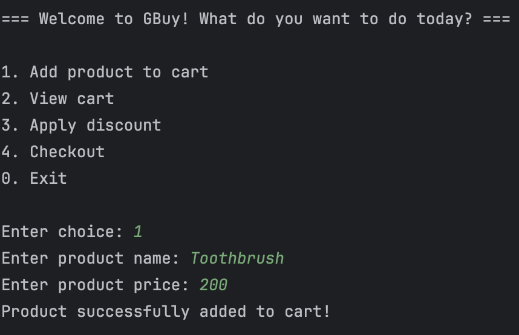
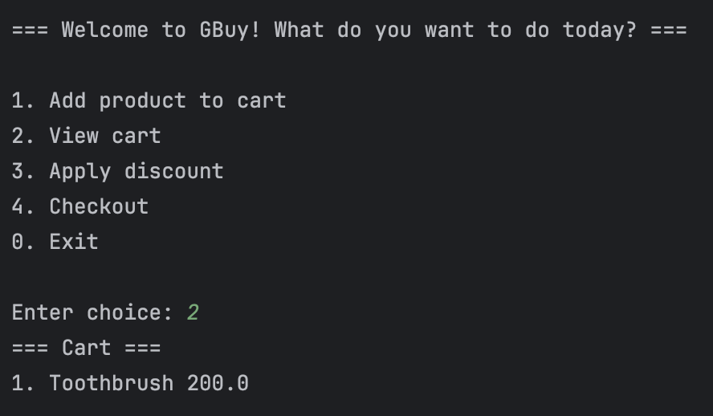
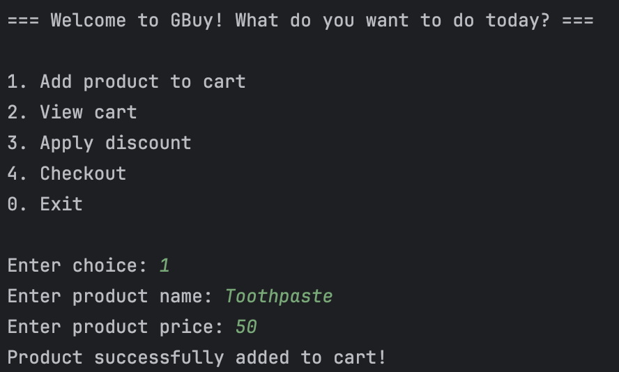
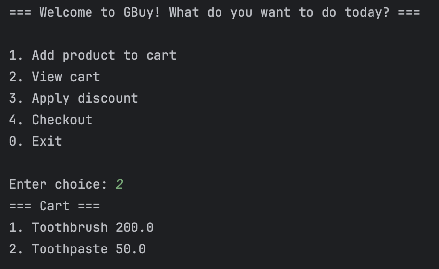
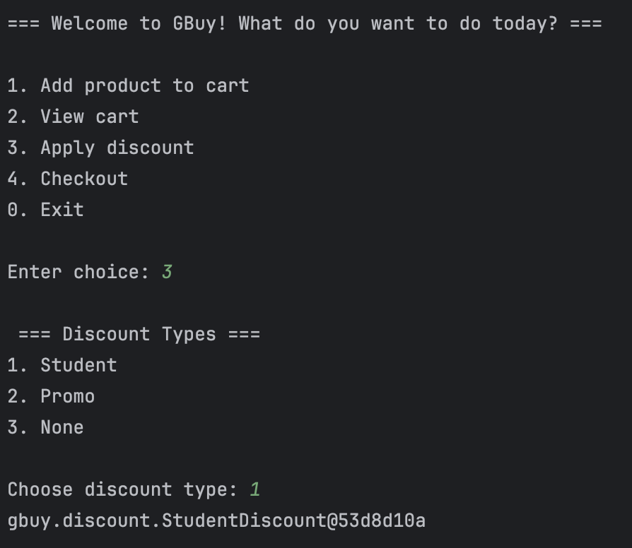
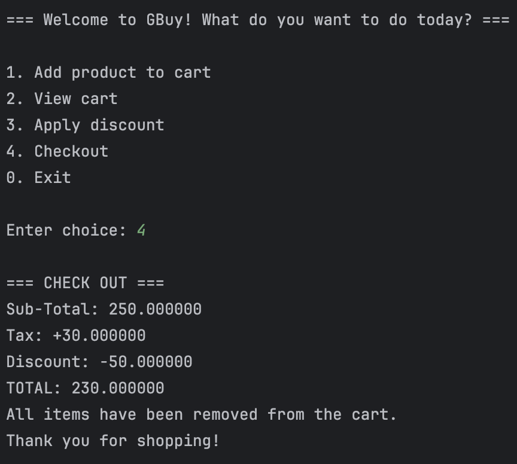
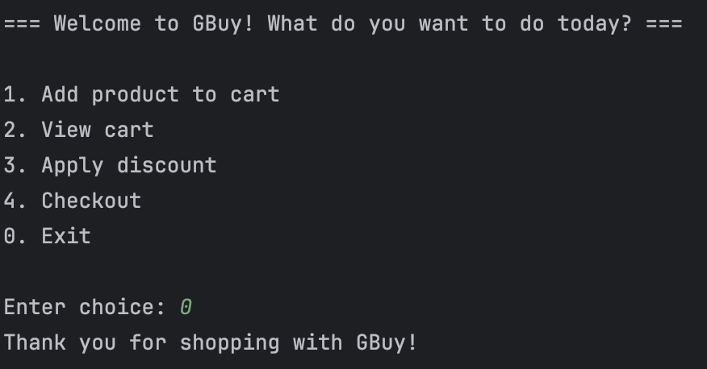

# FECP5 1005-Session 2-Lab 3: Java OOP Capstone Project
Developed by G13
- Baruc, Jana Enigma
- Baticos, Andric Quinn
- Choa, Christian Julien

### Brief Description of the Project
**GBuy: A streamlined terminal-based E-commerce Checkout System**. GBuy offers a quick and efficient way for users to manage their purchases. Key features include easy **item addition to a shopping cart**, flexible **discount application** (supporting student and promotional codes), and **automatic total calculation**(subtotal + tax - discount) at checkout. Upon completion, a clear and concise **receipt** is instantly generated, providing a complete summary of the transaction. Ideal for fast-paced retail environments or simplified online ordering.

### Project Structure
```declarative
.
├── pom.xml
├── README.md
├── src
│   ├── main
│   │   ├── java
│   │   │   └── gbuy
│   │   │       ├── Cart.class
│   │   │       ├── Cart.java
│   │   │       ├── discount
│   │   │       │   ├── DiscountStrategy.class
│   │   │       │   ├── DiscountStrategy.java
│   │   │       │   ├── PromoDiscount.class
│   │   │       │   ├── PromoDiscount.java
│   │   │       │   ├── StudentDiscount.class
│   │   │       │   └── StudentDiscount.java
│   │   │       ├── GBuy.class
│   │   │       ├── GBuy.java
│   │   │       ├── Product.class
│   │   │       └── Product.java
│   │   └── resources
│   └── test
│       └── java
│           └── gbuy
│               └── discount
│                   ├── PromoDiscountTest.java
│                   └── StudentDiscountTest.java
└── target
    ├── classes
    │   └── gbuy
    │       ├── Cart.class
    │       ├── discount
    │       │   ├── DiscountStrategy.class
    │       │   ├── PromoDiscount.class
    │       │   └── StudentDiscount.class
    │       ├── GBuy.class
    │       └── Product.class
    ├── generated-sources
    │   └── annotations
    ├── generated-test-sources
    │   └── test-annotations
    └── test-classes
        └── gbuy
            └── discount
                ├── PromoDiscountTest.class
                └── StudentDiscountTest.class
```

### Screenshot of Proof
#### Adding Product to Cart

#### Viewing the Added Product to Cart

#### Adding Another Product to Cart

#### Viewing Products

#### Applying Discount

#### Checking Out

#### Exiting the System
